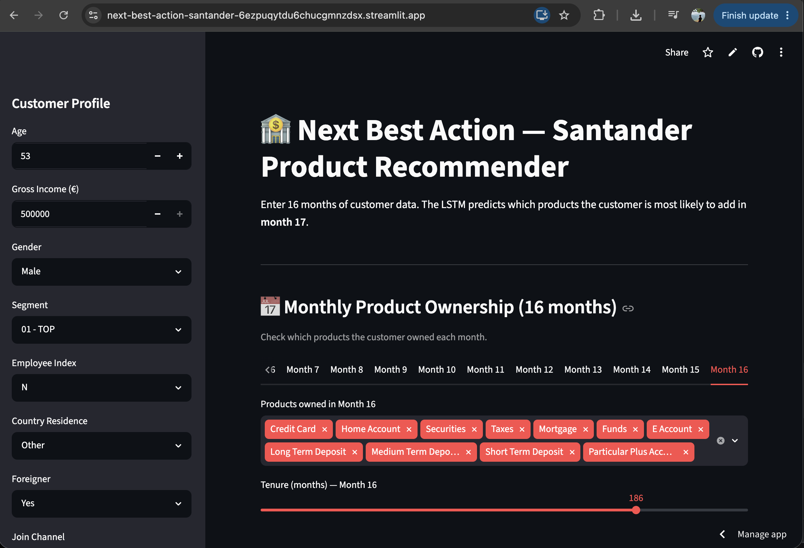

# 🏦 Next Best Action — Santander Product Recommender

An LSTM-based sequential recommendation system that predicts which financial products a Santander bank customer is likely to add next month, trained on 16 months of behavioral history.

🔗 **[Live Demo](https://next-best-action-santander-6ezpuqytdu6chucgmnzdsx.streamlit.app/)**

---

## App Preview



---

## Overview

Banks generate significant revenue by cross-selling products at the right moment. This project frames that as a **sequence modeling problem**: given a customer's product ownership and demographic history over 16 months, predict new acquisitions in month 17.

The model outputs independent probabilities for 10 target products simultaneously (multi-label), allowing the bank to rank and surface the single highest-confidence recommendation — the **Next Best Action**.

---

## Model Architecture

| Component | Detail |
|---|---|
| Architecture | 2-layer LSTM |
| Hidden size | 128 |
| Input | (batch, 16 months, 239 features) |
| Output | 10 sigmoid probabilities |
| Loss | BCEWithLogitsLoss |
| Optimizer | Adam (lr=0.001) |
| Training data | 39,766 customers |
| Evaluation metric | Per-product AUC |

**Feature engineering:** Raw product ownership flags (0/1) are differenced month-over-month per customer. A `diff=1` indicates a new acquisition that month. The model learns to predict these acquisition events, not static ownership — making it sensitive to *change* rather than current state.

---

## Dataset

[Santander Product Recommendation](https://www.kaggle.com/c/santander-product-recommendation) — Kaggle competition dataset.

- ~900k customers, 17 monthly snapshots (Jan 2015 – May 2016)
- 24 financial products tracked as binary ownership flags
- This project uses a 50k customer sample (~845k rows)
- 10 most-acquired products selected as prediction targets

---

## Target Products

| Product | Description |
|---|---|
| `direct_debit` | Direct debit account |
| `credit_card` | Credit card |
| `current_account` | Standard current account |
| `payroll_account` | Payroll-linked account |
| `e_account` | Online account |
| `long_term_deposit` | Long-term savings deposit |
| `taxes` | Tax payment product |
| `securities` | Investment securities |
| `funds` | Investment funds |
| `particular_account` | Particular savings account |

---

## Setup

### Requirements
- Python 3.9+
- scikit-learn **1.6.1** (pinned — must match the version used to save the scaler)

### Installation

```bash
git clone https://github.com/your-username/next-best-action-santander
cd next-best-action-santander
pip install -r requirements.txt
```

### Model Files

Place these in the root directory alongside `app.py`:

```
nba_model_final.pt       ← trained LSTM weights
nba_scaler.pkl           ← StandardScaler fitted on training data
nba_feature_cols.json    ← ordered feature column list (239 features)
```

### Run

```bash
streamlit run app.py
```

---

## App Usage

1. Set the **customer profile** in the sidebar (age, income, segment, demographics)
2. In the main panel, select which products the customer owned **each month** across 16 months
3. Click **Predict Month 17 Products**
4. The model outputs a probability score for each of the 10 target products and highlights the top recommendation

---

## Project Structure

```
├── app.py                  # Streamlit application
├── requirements.txt        # Python dependencies
├── nba_model_final.pt      # Model weights
├── nba_scaler.pkl          # Fitted scaler
├── nba_feature_cols.json   # Feature column list
├── app_screenshot.png      # App preview
└── README.md
```

---

## Notes

- Inference runs on **CPU** — no GPU required
- The train/val/test split is customer-level random (80/10/10)
- Negative diffs (product dropped) are clipped to 0 — model only predicts acquisitions
- Products with near-zero acquisition rates in the sample were excluded from targets (AUC undefined with too few positives)

---

## Tech Stack

`Python` `PyTorch` `scikit-learn` `Streamlit` `pandas` `numpy`
